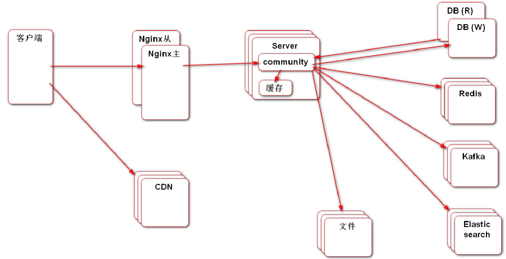
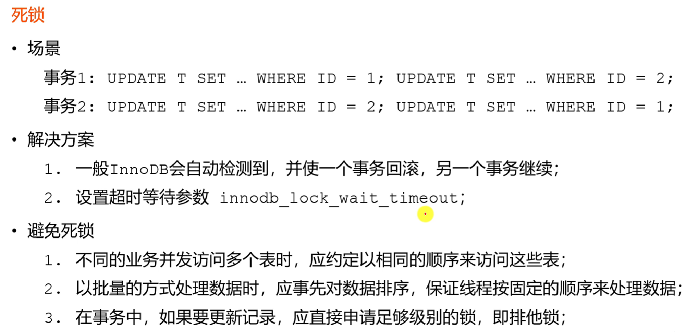
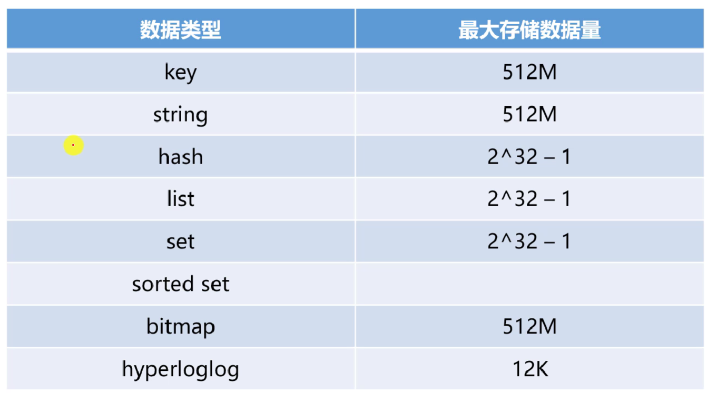
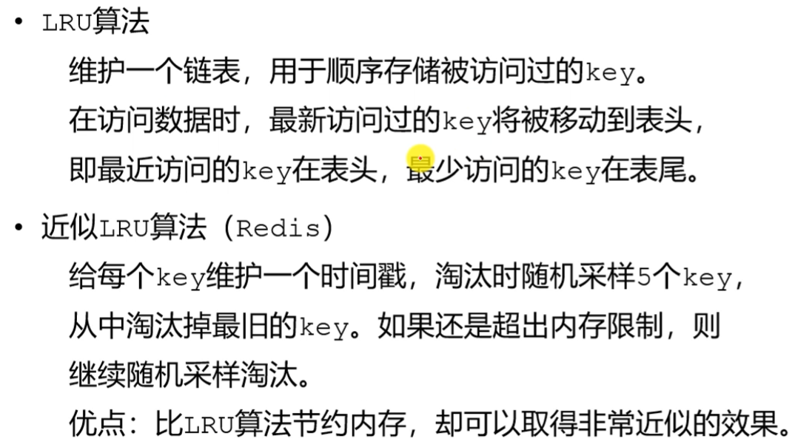
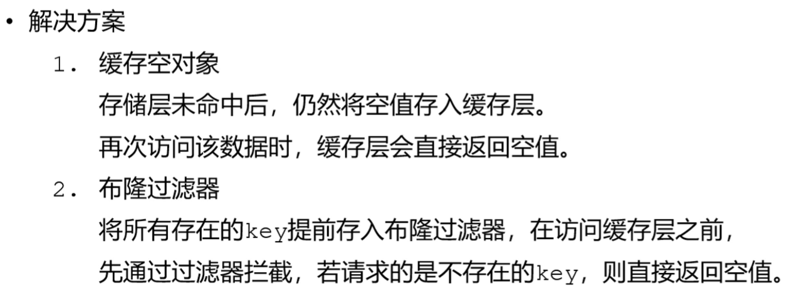
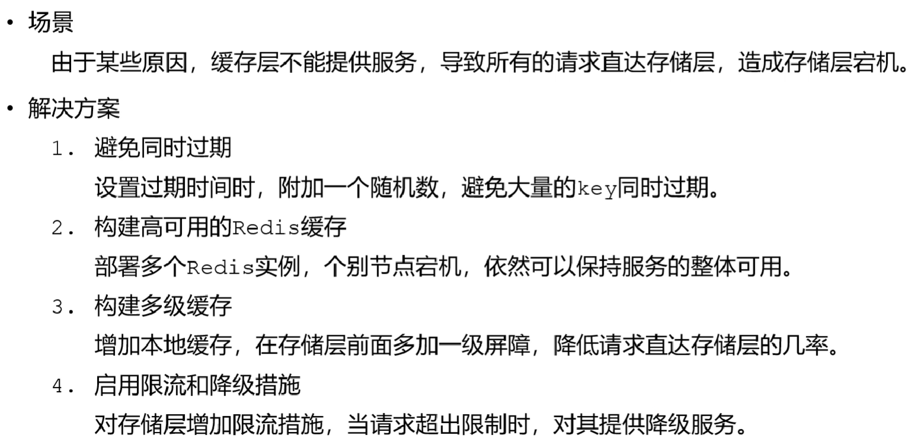
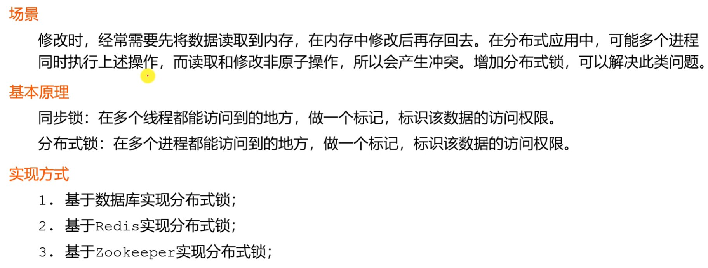
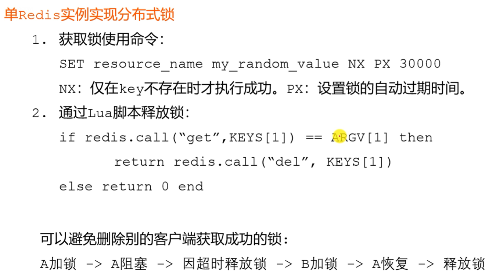
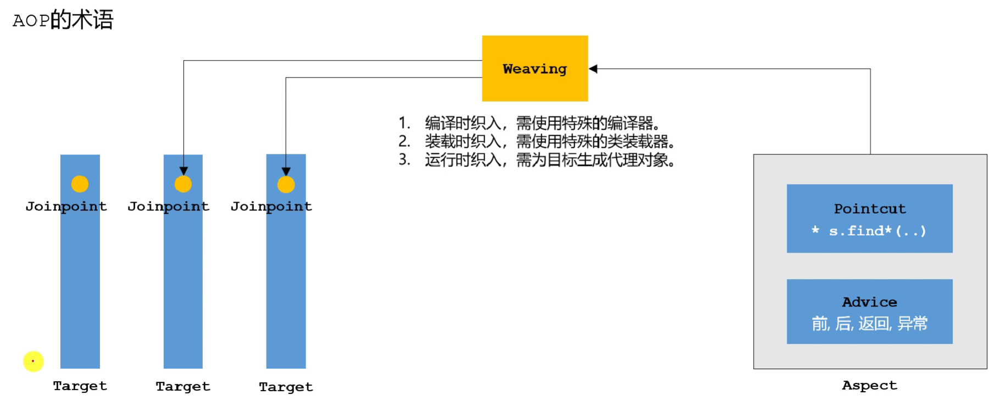

# community 项目

## 项目介绍
S:本项目是一个社交项目，目的是构建一个社区交流平台，用户可以在平台上发帖、评论、点赞、关注、私信和搜索等功能。

A:项目使用的技术栈有Spring Boot、SSM、Redis、Kafka、
Elasticsearch、Quartz和Caffeine。登录功能使用了Redis存储登
录的ticket和验证码（hostHolder），权限控制使用了Spring Security进行统一的
权限管理，有三种角色（普通用户、版主、管理员），不同的角色有不同的权限。
使用Redis高级数据类型HyperLogLog统计UV(Unique Visitor)，使用Bitmap统计
DAU(Daily Active User)。为了防止短时间高并发对数据库产生影响，使用Kafka消息队列实现系统消息通知，并使用事件进行
封装，构建强大的异步消息系统，加快系统响应。针对数据库中大文本数据模糊查询效率
低下问题，使用ElasticSearch提高帖子的搜索性能，并实现关键词高亮显示。使用分布式
缓存Redis和本地缓存Caffeine作为多级缓存，避免了缓存雪崩，提升了网站访问速度，
并使用Quartz定时更新热帖排行。对于异常，使用全局异常统一处理，对于日志，使用AOP统一日志进行记录，
降低代码的耦合度，提升代码的可维护性和可扩展性。

R:通过使用Jmeter对项目的QPS性能进行测试，使用了多级缓存之后，QPS提升超过10倍。

## 项目优化
 - 统计处理异常
 - 统一记录日志
 - 多级缓存
 - 激活码存入Redis而不是MySQL

## Mapper实现
- xml
- 接口注解

## 敏感词过滤
前缀树
- Trie、字典树、查找树
- 查找效率高，消耗内存大
- 应用：字符串检索、词频统计、字符串排序等

敏感词过滤器
- 定义前缀树
- 根据敏感词，初始化前缀树
- 编写过滤敏感词的方法

## 发布帖子
- fastjson
- ajax
- 敏感词过滤
- 转译HTML标签内容为普通文本（HtmlUtils.htmlEscape）

## 帖子详情页
- utext格式显示
- 日期格式化
-`（th:text="${#dates.format(discussPost.createTime,'yyyy-MM-dd HH:mm:ss')}）`
- 首页帖子列表点击链接
- `th:href="|@{/discussPost/detail/${item.post.id}|"`

## 事务管理
- 编程式事务
- 声明式事务

## 评论
- 评论entityType 可以使帖子或评论（回复）
- 评论entityId
- 查询一页评论数据
- 查询评论的数量
- 评论：对帖子的操作
- 回复：对评论的操作
- 楼层`th:text="${page.offset + comment.count}`
- 详细显示逻辑

- 添加评论数据+修改帖子的评论数量（事务管理）

## 私信列表
- 会话id: 小id_大id
- 私信列表
- 私信详情

## 发送私信
- 异步发送
- 发送成功后刷新私信列表

## 设置已读
- 访问私信详情时

## 统一处理异常
- ControllerAdvice

## 统一记录日志
- AOP
- Target(目标对象):很多Target对象
  - Joinpoint(连接点):每个Target对象有很多Joinpoint
- Aspect
  - Pointcut(切点):哪些对象的哪些位置
  - Advice(通知):具体植入的系统逻辑 + 位置（前、后、返回、异常）

- AOP的实现
  - AspectJ
  - Spring AOP
    - CGLIB

- Aspect内获取Request/ip
  - RequestContextHolder

## Redis
- 场景
  - 缓存、排行榜（热门帖子）、计数器（帖子访问量）、社交网络（点赞、关注）、消息队列
  - 配置RedisTemplate
- 编程式事务
  - multi()
  - exec()
  - 事务中不要做查询（Redis事务指令存放在队列中，最后提交时才全执行，所以查询为空）
- RedisKeyUtil
- 点赞
  - 帖子、评论点赞
  - 点赞与取消点赞
  - 首页点赞数量
  - 详情页点赞数量
  - 显示点赞状态
  - like(this,entityType,entityId) 
    - 三种点赞 帖子1 两种评论2 
    - set中存放用户id集合
- 收到的赞
  - 以用户为key记录点赞数量
  - increment(key) decrement(key)
  - 开发个人主页 查询点赞量
  - 问题
    - th:onclick()中变量不能传字符串
    - discussPost中userId字段误设为String,应为int,数据库中是varchar
- 关注
  - 关注数、粉丝数
- 关键
  - Follower/Followee
    - 不能关注自己
    - 用户未登录判断
  - 目标可以是用户、帖子、题目等，抽象为实体

## 关注、粉丝列表
- 分页

## 优化登录模块
- Redis存储验证码
  - 登录前生成
  - 登录后验证
- Redis存储登录凭证（ticket）
  - 登录后存储
  - 退出后删除
  - 查询凭证处理
- Redis缓存用户信息

## 系统消息
- 阻塞队列(BlockingQueue)
  - put
  - take
- kafka
  - 一个分布式的流媒体平台
  - 应用
    - 消息系统、日志收集、用户行为跟踪、流式处理
  - 特点
    - 高吞吐量、消息持久化（硬盘）、高可靠性（分布式）、高扩展性
  - 术语
    - Broker(服务器)、Zookeeper(管理集群)
    - Topic(存放消息的位置/空间，点对点、发布订阅)、Partition(一个主题多个分区，高并发)、Offset(消息在分区内存放的索引)
    - Leader Replica(主副本，负责处理请求，每个分区多个副本)、Follower Replica(从副本，只负责备份)
  - 配置
    - zookeeper.properties中数据存放目录
    - server.properties中日志存放目录
- Spring整合Kafka
  - 引入依赖
    - spring-kafka
  - 配置Kafka
    - server、consumer
  - 访问Kafka
    - 生产者
      - kafkaTemplate.send(topic, data)
    - 消费者
      - @kafkaListener(topic={"test"})
      - public void handleMessage(ConsumerRecord record)
- 发送系统通知（通知放在message表中）
  - 触发事件
    - 评论后 comment
    - 点赞后 like
    - 关注后 follow 
  - 处理事件
    - 封装事件对象
    - 开发事件的生产者
    - 开发事件的消费者

## 显示系统消息
- 评论
- 点赞
- 关注
- 消息数量显示Intercepter

## Elasticsearch搜索
- 简介
  - 一个分布式的、Restful风格的搜索引擎
  - 支持对各种类型的数据的检索
  - 搜索速度快，可以提供实时的搜索服务
  - 便于水平扩展，每秒可以处理PB级海量数据
- 术语
  - 6.0以前：索引（数据库）、类型（表）、文档（JSON）（行）、字段（列）
  - 7.0以后：索引（表）、文档（JSON）（行）、字段（列）
  - 集群、节点、分片（索引的进一步划分）、副本
- springboot使用6.4.3/7.15.2
- 配置文件
  - cluster.name: nowcoder
  - path.data:
  - path.logs:
- 中文分词插件
  - ik(github)
  - 注意版本对应
  - elasticsearch/plugins/ik
  - 新词典配置 ik/config/IKAnalyzer.cfg.xml添加即可
- 命令
  - 查看集群状态：curl -X GET "ip:9200/_cat/health?v"
  - 查看集群节点：curl -X GET "ip:9200/_cat/nodes?v"
  - 查看索引：curl -X GET "ip:9200/_cat/indices?v"
  - 创建索引：curl -X PUT "ip:9200/test"
  - 删除索引：curl -X DELETE "ip:9200/test"
  - 搜索：curl -X GET "ip:9200/test/_search?q=title:*"
  - 多域搜索

  ```json
  {
    "query": {
      "multi_match": {
        "query": "互联网",
        "fields": ["title","content"]
      }
    }
  }
  ```
  
- SpringBoot整合Elasticsearch
  - 引入依赖
  - 配置Elasticsearch
    - cluster-name、cluster-nodes
  - Spring Data Elasticsearch
    - ElasticsearchTemplate（spring自带）
      - 有些情况ElasticsearchRepository处理不了就使用这个
    - ElasticsearchRepository（自己写）
      - 写一个接口
      - 继承ElasticsearchRepository<DiscussPost, Integer(主键类型)>
      - 方法
        - 插入数据：*Repository.save(DiscussPost)
        - 修改数据：*Repository.save(修改后的DiscussPost)
        - 删除数据：*Repository.deleteById(id)/deleteAll()
        - 搜索数据：
          - 构造查询条件
          - ```java
            SearchQuery searchQuery = new NativeSearchQueryBuilder().withQuery(QueryBuilders.multiMatchQuery("互联网寒冬", "title", "content")).withSort(SortBuilders.fieldSort("type").order(SortOrder.DESC)).withSort(SortBuilders.fieldSort("score").order(SortOrder.DESC)).withSort(SortBuilders.fieldSort("createTime").order(SortOrder.DESC)).withPageable(PageRequest.of(0, 10)).withHighlightFields(
                        new HighlightBuilder.Field("title").preTags("<em>").postTags("</em>"),
                        new HighlightBuilder.Field("content").preTags("<em>").postTags("</em>")
                ).build();
          - 分页查询
          - ```java
            // elasticTemplate.queryForPage(searchQuery, class, SearchResultMapper)
            // 底层获取得到了高亮显示的值, 但是没有返回.
            Page<DiscussPost> page = discussRepository.search(searchQuery);
            
            // 使用Template可处理高亮
            Page<DiscussPost> page = elasticTemplate.queryForPage(searchQuery, DiscussPost.class, new SearchResultMapper() {
            @Override
            public <T> AggregatedPage<T> mapResults(SearchResponse response, Class<T> aClass, Pageable pageable) {
                SearchHits hits = response.getHits();
                if (hits.getTotalHits() <= 0) {
                    return null;
                }
                List<DiscussPost> list = new ArrayList<>();
                for (SearchHit hit : hits) {
                    DiscussPost post = new DiscussPost();
                    // 处理高亮显示的结果
                    HighlightField titleField = hit.getHighlightFields().get("title");
                    if (titleField != null) {
                        post.setTitle(titleField.getFragments()[0].toString());
                    }

                    HighlightField contentField = hit.getHighlightFields().get("content");
                    if (contentField != null) {
                        post.setContent(contentField.getFragments()[0].toString());
                    }

                    list.add(post);
                }

                return new AggregatedPageImpl(list, pageable,
                        hits.getTotalHits(), response.getAggregations(), response.getScrollId(), hits.getMaxScore());
            }});

    - 9300TCP 9200HTTP
    
  - 处理问题
    - redis底层的netty和Elasticsearch底层的netty冲突
    - 看Netty4Utils.setAvailableProcessors()发现问题，有一个开关可以解决
    - 在Application启动类中，构造方法后执行System.setProperty("es.set.netty.runtime.available.processors", "false")
  - 对应映射关系
    - Entity类->Elasticsearch（实体和索引对应关系）
      - 6.0:@Document(indexName="discusspost", type="_doc", shards=6, replicas=3)
    - Entity类属性和Elasticsearch字段
      - @Id
      - @Field(type = FieldType.Integer/Double/Date)
      - @Field(type = FieldType.Text, analyzer="ik_max_word", searchAnalyser="ik_smart")
        - ik_max_word: 将内容拆分出对应得搜索词，拆分出最多的词
        - ik_smart: 搜索时的内容拆分出词，聪明的拆分，较少的词
- 社区搜索功能
  - 搜索服务
    - 帖子通过Elasticsearch保存、删除、搜索
  - 发布事件（kafka）
    - 发布帖子/增加评论时将帖子异步提交到Elasticsearch
    - 消费帖子发布事件
  
## 项目进阶
### Spring Security
- 认证、授权
- 防止各种攻击
- 与各种web技术集成
- 轻松扩展
- Filters(拦截)->[DispatcherServlet(1个)->Interceptors(拦截)->Controllers]Spring MVC
- Spring Security 使用Filter(拦截后直接不能进入DispatcherServlet)

### 权限控制
- 登录检查
  - 废弃拦截器的登录检查
- 授权配置
  - 分配访问权限（普通用户、版主、管理员）
  - 在SecurityConfig中重写configure(HttpSecurity http)方法，设置路径需要的权限
  - 覆盖默认拦截/logout，使用自己的
- 认证方案
  - 绕过Security认证流程，采用系统原来的认证方案
  - 在LoginTicketInterceptor中生成Authentication放入SecurityContext中（根据ticket获取hostHolder时）
  - 在LoginTicketInterceptor中清空SecurityContext（清空hostHolder时）
  - 在LoginController中退出登录时清空SecurityContext
- CSRF配置
  - 防止CSRF攻击的基本原理，以及表单、Ajax相关的配置
  - 开启后form附带token
  - 异步调用将token附带在请求头中
  - 开启CSRF需要修改js请求,否则异步请求不携带token,会认证失败
### 置顶、删除、加精
  - 即修改帖子状态和类型
  - 权限管理：版主置顶和加精，管理员删除
  - 显示：版主显示置顶和加精按钮，管理员显示删除按钮（thymeleaf-extras-springsecurity组件|github）
### Redis高级数据类型
  - HyperLogLog
    - 采用一种基数算法，用于完成独立总数的统计
    - 只占12K的内存空间
    - 不精确的统计算法，标准误差为0.81%
    - UV(unique visitor)
      - 独立访客，通过IP
  - Bitmap
    - 字符串
    - 支持按位存取，看成byte数组
    - 适合存储检索大量的连续的数据的布尔值
    - DAU(Daily Active User)
      - 日活跃用户，通过用户ID
## 任务执行和调度
  - JDK线程池
    - ExecutorService
    - ScheduledExecutorService
  - Spring 线程池
    - ThreadPoolTaskExecutor
    - ThreadPoolTaskScheduler
  - 分布式定时任务
    - Spring Quartz
      - 需要结合 数据库表
      - Job + (JobDetail + Trigger)FactoryBean配置类中
## 热帖排行
  - log(精华分 + 评论数*10 + 点赞数*2 + 收藏数*2) + (发布事件 - 时间纪元)
  - log前期权重高，后期权重低，可以给前期帖子加大权重，随时间逐渐变低
  - 帖子表里有Score属性
  - 点赞、评论、收藏时把分数变化的帖子放在缓存里（Set去重），定时时间到再计算排行，不用计算其他没有变化的
  - 新增帖子时、加精时、评论时、点赞时
  - 删除的帖子不参与排行
  - HomeController注意细节 

## 生成长图
  - wkhtmltopdf
    - wkhtmltopdf url file
    - wkhtmltoimage url file
  - java
    - Runtime.getRuntime().exec()

## 将文件上传至云服务器
  - 客户端上传
    - 客户端将数据提交给云服务器，并等待其响应
    - 用户上传头像时，将表单数据提交给云服务器
  - 服务器直传
    - 应用服务器将数据直接提交给云服务器，并等待其响应
    - 分享时，服务端将自动生成图片，直接提交给云服务器

## 优化网站的性能
  - 本地缓存
    - 将数据缓存在应用服务器上，性能更好
    - 常用缓存工具：Ehcache、Guava、Caffeine
    - 用户身份Token不适合放在本地缓存，否则访问不同的服务器会找不到
    - 适用于变化不频繁的数据，如热门排行（前*页），帖子总数
    - 不用Spring整合，因为一个缓存管理器管理所有缓存，如果需要多种类型功能用缓存，需要多个配置
    - offset:limit作为key
  - 分布式缓存
    - 将数据缓存在NoSQL数据库上，跨服务器
    - 常用缓存工具：MemCache、Redis
  - 多级缓存
    - 一级缓存（本地缓存）->二级缓存（分布式缓存）->DB
    - 避免缓存雪崩，提高系统的可用性
  - Jmeter性能测试(100/sec->400/sec)
    - 服务器性能瓶颈
    - 内置Tomcat性能瓶颈

## 测试、监控、部署
  - Spring Boot Starter Junit
  - Spring Boot Actuator
    - Endpoints:监控应用的入口，Spring Boot内置了很多端点，也支持自定义端点
    - 监控方式：HTTP/JMX
    - 访问路径：例如"/actuator/health"
    - 注意事项：按需暴露端点，并对所有端点进行权限控制
## 项目总结
  - 项目架构
    - 
  - 部署架构
    - Nginx(主从)、CDN(静态资源)、DB(读写分离)、集群部署、Kafka、ElasticSearch、Redis集群、文件服务器
    - 
## 重点问题
  - MySQL
    - 存储引擎、事务、锁、索引
      - 
  - Redis
    - 数据类型、过期策略、淘汰策略、缓存穿透、缓存击穿、缓存雪崩、分布式锁
      - 
      - 
      - 
      - 缓存穿透
      - 
      - 缓存击穿（某一个数据不可以）
      - 
      - 缓存雪崩（大批量的数据不可用）
      - 
      - 分布式锁
      - 
      - 
      - 
      - 
  - Spring
    - Spring IoC、Spring AOP、Spring MVC
      - 
## 遇到问题
- 使用kafka在servicelog中不能获取ServletRequestAttributes
- 错误使用String类型标会userId，使得html多参调用函数出现问题
- 内存不足，不能启动Elasticsearch，通过设置Elasticsearch和kafka的内存大小
- Elsticsearch版本问题
  - 日期转换问题 空格不行
  - yyyy-MM-dd'T'HH:mm:ss.SSSXXX才可以
- 在Interceptor中afterCompletion内清空SecurityContext，使得登录了第二次点击也会跳转到登录页面，这里不能清空，点击退出时才清空
- redis一段时间后自动过期

## 优化
- 全局异常处理
- Redis
- Nginx

1. 全局异常处理 ：很多项目这方面都做的不是很好，可以参考我的这篇文章：《使用枚举简单封装一个优雅的 Spring Boot 全局异常处理！》 来做优化。
2. 项目的技术选型优化 ：比如使用 Guava 做本地缓存的地方可以换成 Caffeine 。Caffeine 的各方面的表现要更加好！再比如 Controller 层是否放了太多的业务逻辑。
3. 数据库方面 ：数据库设计可否优化？索引是否使用使用正确？SQL 语句是否可以优化？是否需要进行读写分离？
4. 缓存 ：项目有没有哪些数据是经常被访问的？是否引入缓存来提高响应速度？
5. 安全 ： 项目是否存在安全问题？
6. ......


## docker相关

### mysql
```shell
docker run -itd --name mysql-test -p 3306:3306 -e MYSQL_ROOT_PASSWORD=123456 mysql
```

### redis
```shell
docker pull redis
docker run -itd --name redis-test -p 6379:6379 redis
```

### zookeeper + kafka
```shell
# zookeeper/kafka均为latest
docker pull zookeeper
docker pull kafka
docker run -d --name zookeeper -p 2181:2181 -t wurstmeister/zookeeper
docker run -d --name kafka \
        -p 9092:9092 \
        -e KAFKA_BROKER_ID=0 \
        -e KAFKA_ZOOKEEPER_CONNECT=124.223.117.133:2181 \
        -e KAFKA_HEAP_OPTS=-Xmx512m \
        -e bootstrap-server=124.223.117.133:9092 \
        -e KAFKA_ADVERTISED_LISTENERS=PLAINTEXT://124.223.117.133:9092 \
        -e KAFKA_LISTENERS=PLAINTEXT://0.0.0.0:9092 wurstmeister/kafka
```

### Elasticsearch
```bash
docker pull elasticsearch:7.16.3
docker run --name elasticsearch -d -e ES_JAVA_OPTS="-Xms256m -Xmx256m" -e "discovery.type=single-node" -p 9200:9200 -p 9300:9300 elasticsearch:7.16.3
docker exec -it elasticsearch /bin/bash
./bin/elasticsearch-plugin install https://github.com/medcl/elasticsearch-analysis-ik/releases/download/v7.16.3/elasticsearch-analysis-ik-7.16.3.zip
```

